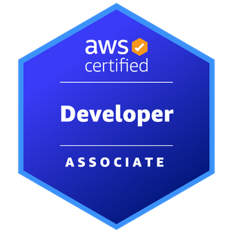

<h1 align='center'>Serverless and Cloud Solution Architect</h1>

Welcome to Jarad's Profile, Solutions Architect, Professional Services Engineer and Site Realiability.

Open to collaboration and anything serverless, cloud or blockchain related.

Please feel free to reachout and engage with me about open source project and public project development,

    <a href='https://www.linkedin.com/in/jaradclouston/'>LinkedIn,</a>Jarad Clouston   |
    Discord, MrCloudston (MrCloudston#8324)

<!---
MrCloudston/MrCloudston is a ✨ special ✨ repository because its `README.md` (this file) appears on your GitHub profile.
You can click the Preview link to take a look at your changes.
--->
